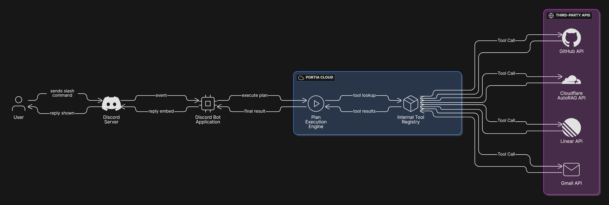

<h1 align="center">Nir - Product Manager Agent</h1>
<p align="center"><em>
An Multi Agent System disguised as a Discord bot that acts as an AI-powered Product Manager, automating workflows between Discord, GitHub, and Linear using <strong>Portia AI</strong>.
</em></p>
---

## 🎯 The Problem

Software development teams constantly struggle with friction between communication and execution. Ideas and bug reports emerge in conversational platforms like Discord, but they require manual effort to be logged, triaged, and prioritized in project management tools like Linear and GitHub. This context-switching is inefficient and leads to information gaps.

This project solves that problem by creating an AI agent that lives where the team communicates. It automates the entire feedback loop, from initial report to ticket creation, and even provides intelligent analysis for prioritization and planning.

---
## ⚙️ Workflow

The bot operates on a simple yet powerful workflow orchestrated by **Portia AI's `PlanBuilderV2`**:

1.  **User Interaction**: A team member issues a slash command in Discord (e.g., `/bug-report`).
2.  **Plan Execution**: The Discord bot triggers a specific, pre-defined Portia Plan.
3.  **AI-Agent Steps**: The plan executes a sequence of steps, which can include:
    * Using an **LLM** for reasoning (e.g., expanding a bug report, prioritizing issues).
    * Calling **Tools** to interact with external services (e.g., creating a GitHub issue, updating a Linear ticket).
    * Making direct **API calls** (e.g., querying a documentation backend on Cloudflare AutoRAG).
4.  **Formatted Response**: The bot receives the final, structured output from the plan and presents it back to the user in a clean, formatted Discord embed.

---
## Architecture

<p align="center">
  
</p>

---
## Demo Video

<p align="center">
  <a href="https://youtu.be/H6xG90Efa90">
    Demo Video
  </a>
</p>

---

## ✨ Features

The bot provides a suite of commands that mimic the responsibilities of a Product Manager.

| Command              | Description                                                                                             | Inputs                  |
| :------------------- | :------------------------------------------------------------------------------------------------------ | :---------------------- |
| **`/bug-report`** | Submits a bug, expands the description, creates a GitHub/Linear ticket, and sends a confirmation email. | `description`, `email`  |
| **`/feature-request`** | Submits a feature idea, formats it as a user story, creates tickets, and sends an email.                | `description`, `email`  |
| **`/doc`** | Searches the team's documentation using a Cloudflare AutoRAG backend for an instant answer.             | `query`                 |
| **`/triage`** | Scans all Linear issues and generates a report of untriaged items with suggested priorities and labels. | *None* |
| **`/priority`** | Analyzes all triaged issues and returns a ranked list of the top 3-5 most critical tasks for the team.  | *None* |
| **`/digest`** | Generates and posts a "Weekly Digest" summarizing all issues created and completed in the last 7 days.  | *None* |
| **`/help`** | Displays a list of all available commands.                                                              | *None* |

---

## 🛠️ Tools & Integrations

This project makes use of several services to achieve its workflow:

* **Portia AI**: The core agentic framework for building, running, and observing the AI plans.
* **Linear**: For project and issue management.
* **GitHub**: For issue tracking and code repository management.
* **Google Gmail**: For sending email confirmations.
* **Cloudflare AutoRAG**: Powers the backend for the `/doc` search command.

---

<p align="center">
  <a href="https://discord.gg/ZhwgcAK9" target="_blank" style="font-size: 1.5em; font-weight: bold; text-decoration: none;">
    Try the Bot
  </a>
</p>

## 🚀 Getting Started

Follow these steps to set up and run the bot locally.

### Prerequisites
* Python 3.11+
* `uv` (or `pip` and `venv`)

### 1. Clone the Repository
```bash
git clone <your-repo-url>
cd <your-repo-folder>

2. Configure Environment Variables

Create a file named `.env` in the root of the project by copying the example template:

```bash
cp .env.example .env
```

Open the `.env` file and fill in your secrets and API keys:

```env
# Discord
DISCORD_TOKEN=your-discord-bot-token

# Portia / LLM Provider
GOOGLE_API_KEY=your-google-api-key

# Cloudflare AutoRAG
CLOUDFLARE_API_TOKEN=your-cloudflare-api-token
CLOUDFLARE_ACCOUNT_ID=your-cloudflare-account-id
RAG_ID=your-cloudflare-rag-id
```

3. Install Dependencies

**a. Create the virtual environment:**
```bash
uv venv
```

**b. Activate the environment:**
- On macOS/Linux:
    ```bash
    source .venv/bin/activate
    ```
- On Windows PowerShell:
    ```powershell
    .\.venv\Scripts\Activate.ps1
    ```

**c. Install dependencies:**
```bash
uv pip install -r requirements.txt
```

4. Run the Bot

Run the bot from the root project directory using the following command:

```bash
uv run python -m bot
```
